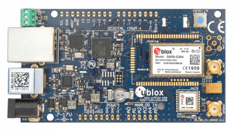
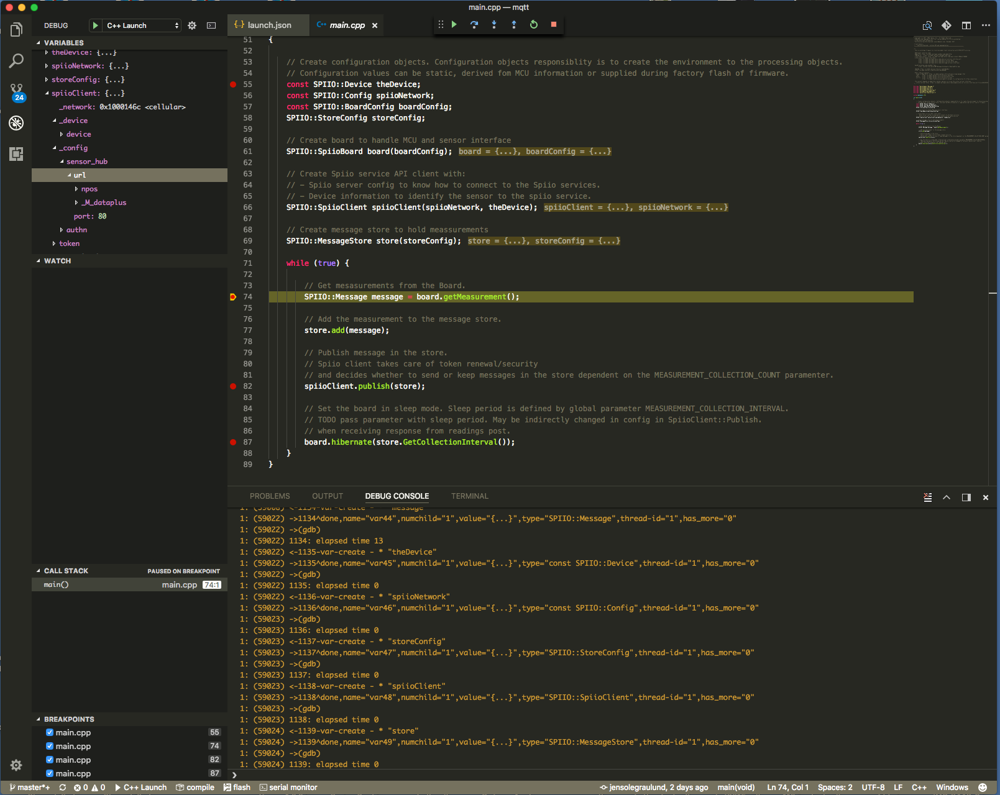

# Introduction

The purpose of this project is to demonstrate and verify the Spiio sensor api and data collection flow including security setup.

It is not meant to be the final firmware but can be used to inspire, gain experience and prototype the firmware with the Mbed OS framework. There is no interface to any sensors but hooks is prepared for sensor libraries.

# Mbed OS development environment

To run this project the Mbed development environment must be established. This includes installing the `mbed-cli` and mbed toolchain.

Follow the mbed-cli installation instruction [here](https://os.mbed.com/docs/v5.6/tools/setup.html/).

It is adviced to select the [GNU Arm Embedded toolchain (GCC) version 6](https://developer.arm.com/open-source/gnu-toolchain/gnu-rm/downloads).

As a supplement you can find a condensed instruction [here](http://grbd.github.io/posts/2016/11/06/using-the-mbed-cli/).

## Configure toolchain

When Mbed cli is installed configure the path to the compiler tool bin directory with:

```
mbed configure GCC_ARM_PATH = "path to compiler bin library"
```

# Install this project

You should validate your Mbed environment setup before installing this project. It is adviced to create an account on the [Mbed Developer Site](https://os.mbed.com/) and export the [mbed-blinky](https://github.com/ARMmbed/mbed-os-example-blinky) example program to your local machine and compile it.

When your Mbed development environment is verified import the Spiio project with:

`mbed import https://github.com/spiio/sensor-firmware-http`

Go to the new directory:

`cd sensor-firmware-http`

and then compile it:

`mbed compile -t GCC_ARM -m ublox_c027 --source .`

If you have a development board connected you can compile with `m -auto`.
Doing a clean build add the parameter `-c`

# Configuration

The sim card configuration is done in the file `mbed-config.h`. In most cases you only need to define the APN.

# Running and debugging
You can debug the firmware by including print statements in the code or use a debugger via VS Code.
## Debugging with print statements
Drag an drop the project `bin` file to your connected boards `DAPLINK` mounted device.

Connect a terminal program to the serial interface of the development board to see log messages.
You can download [CoolTerm](http://freeware.the-meiers.org/) or choose whatever you like or already have.

## Debugging with VS Code
Debugging environment is defined in the VS code file `launch.json`. 
It is only tested on the mac OSX platform and you must first install [PyOCD](https://github.com/mbedmicro/pyOCD) with
```
sudo -H pip install Cython
sudo -H pip install --pre -U pyocd
```

You should also add the GDB debugger library to your PATH if not already present. On OSX edit the path file `vi /etc/paths` and save. 

Open VS code project, switch to the debug view and start debugging. 




# Libraries

The follwoing libraries is added to provide HTTP and JSON parsing capabilities:

* Experimental HTTP and HTTPS library for mbed OS 5
  https://os.mbed.com/teams/sandbox/code/mbed-http/

* JSON parser. Minimal JSON parser for embedded programs
  https://os.mbed.com/users/yoonghm/code/jsmn/

* Ublox variant of mbed Easy Connect
  https://os.mbed.com/teams/ublox/code/easy-connect/

* Ublox cellular interface libraries. These libraries enables different interfaces to the u-blox cellular module. In the source code of easy-connect the specific interface can be selected.  We can use the cellular HTTP capabilities instead og the mbed HTTP-CLIENT libraries. Find an example [here](https://os.mbed.com/teams/ublox/code/example-ublox-at-cellular-interface-ext/file/e1b6cd53333f/main.cpp/)

## External code

A Base 64 encoder is manual added by copying code from: https://github.com/vpcola/MQTTGateway/blob/master/DownloadFile.cpp

Sleep / Deepsleep mode is not implemented yet but found this piece of (old) code https://os.mbed.com/users/Sissors/code/WakeUp/. May be outdated and need to investigate more on this.

# Program logic

The program has configuration and processing objects.

Configuration objects `Device`, `SpiioNetwork`, `BoardConfig` contains setup information:

* `Device` holds important configuration information related to the sensor like DeviceId, Secret, IMEI etc.

* `SpiioNetwork` Configurates information related to the spiio network services urls and ports.

* `BoardConfig` Configuration information related to the MCU.

Some of the information in configuration objects may be written when flashing the firmware in production.
Other values may be read directly on the board.

When Processing the following actors makes it all happen.

* `MessageStore` is the place where sensor measurements is queued.

* `SpiioBoard` represents the board and is able to read measurements and put the MCU to sleep for a configurable amount of time. The class has hooks to specific measurement reading libraries.

* `SpiioClient` handles the publication of messages to Spiio services with proper security including token renewal. Determines when to send messages from the `MessageStore`.

At high level the simple processing is as follow:

```
  Configure the sensor with: 'Device', 'SpiioNetwork', 'BoardConfig'

  Start 'SpiioBoard', 'MessageStore', 'SpiioClient'

  loop

      message = SpiioBoard.getMeasurement() // build measurement messages from sensor readings

      MessageStore.add(message)             // queue the message

      SpiioClient.publish(MessageStore)     // connect and publish when enough messages

      SpiioBoard.hibernate()                // go to sleep

  end-loop
```

and translated into code it will have this form:

```C++
int main(void)
{
    // Estabish TCP socket interface
    NetworkInterface* network = easy_connect(true);
    if (!network) {
        return -1;
    }

    // Create configuration objects. Configuration objects responsiblity is to create the environment to the processing objects.
    // Configuration values can be static, derived fom MCU information or supplied during factory flash of firmware.
    const SPIIO::Device theDevice;
    const SPIIO::Config spiioNetwork;
    const SPIIO::BoardConfig boardConfig;

    // Create board to handle MCU and sensor interface
    SPIIO::SpiioBoard board(boardConfig);

    // Create Spiio service API client with:
    // - TCP network to be establish network connection.
    // - Spiio server network config to know how to connect to the Spiio services.
    // - Device information to identify and authenticate the sensor to the spiio services.
    SPIIO::SpiioClient spiioClient(network, spiioNetwork, theDevice);

    // Create message store to hold measurements
    SPIIO::MessageStore store;

    while (true) {
        // Get mesasurements from the Board.
        SPIIO::Message message = board.getMeasurement();

        // Add the measurement to the message queue.
        store.add(message);

        // Publish message in the store.
        // Spiio client takes care of token renewal/security and
        // send messages in the MessageStore queue when enough measurements.
        spiioClient.publish(store);

        // Set the board in sleep mode. Sleep period is defined in boardConfig..
        board.hibernate();
    }
}
```

# Todos

A number of TODO's is placed in the code. These are ideas or something that we are missing.
We will use GitHub project to track tasks.
